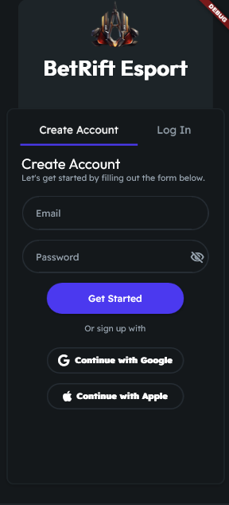

# BetRift-Esport 

Salut Riot on avait pas  de Product URL a proprement parler du coup on a décidé de faire un github en esperant que ça ne vous dérange pas et qu'on soit assez clair sur ce github.
On va vous montrer partie par partie comment se constitue notre application et à la fin on vous dira ce qu'on le souhaite rajouter car tous que vous verrez ci dessous n'est qu'un exemple, vous ne verrez que le squelette de ce qu'on veut faire car il nous faut d'abord pouvoir acccéder a vos données. Et à la fin on vous expliquera qu'elle est le but et qu'elles sont les choses qu'on souhaite rajouter. On reste a votre écoute pour n'importe quelle question.

# Partie Authentification

Alors voici comment notre example se présente (on aimerait pouvoir rajouter une fonctionnalité pour ce connecter via riot)

# Partie Principal

Notre partie principal pour le moment se déroule en 3 parties, la premiere partie où on voit les match esport qu'ils sont prévu, la deuxieme partie où on voit les matchs fini avec les résultats et la derniere partie où on voit les matchs qui sont en cours.
Et on pourra trier les matchs par région.

                

# Partie Profile

Cette partie est juste une partie profile basique on aimerais mettre l'avatar valorant en tant que photo de profile mettre le nom etc...

# Quelle est le but de cette application ??

Le but de cette application est d'impliquer les joueurs dans l'esport de valorant de manière interactive et competitive. L'interaction des joueurs se fait via des pari pour les match esport via une monnaie virtuelle. La monnaie virtuelle sera gratuite chaque joueur pourront chaque jour gagner de la monnaie virtuelle avec des défis sur valorant (par exemple faire 20 kills sur une partie) et en connectant chaque jours. Les joueurs pourront donc parier pour l'équipe qui pense gagner on rajoutera des cotes pour chaque match en fonction des statistiques des matchs précédents.
