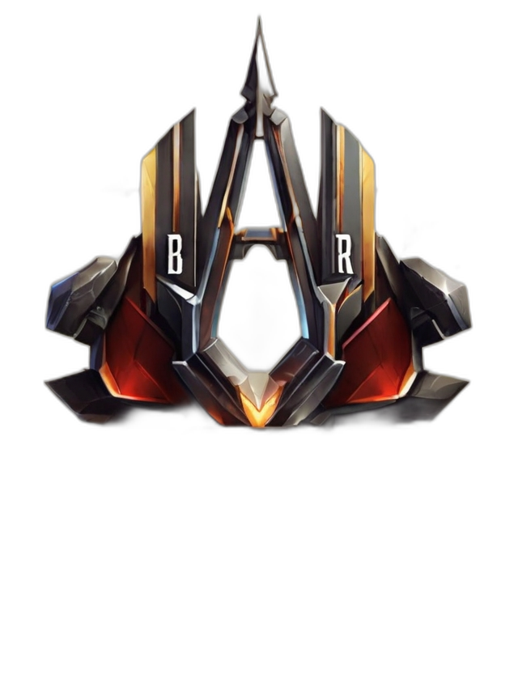
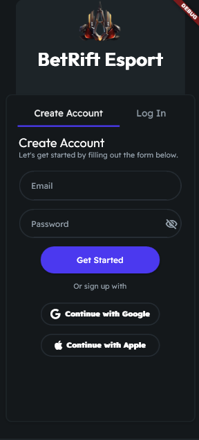
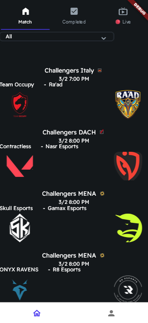
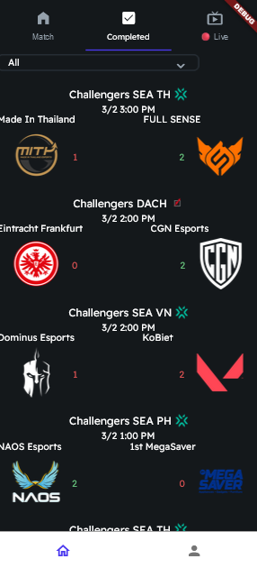
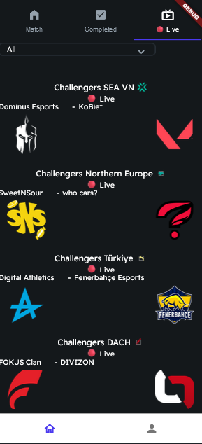
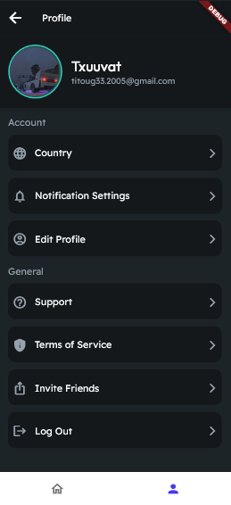

# BetRift-Esport

Hello Riot, we didn't have a proper Product URL, so we decided to create a GitHub, hoping it doesn't bother you, and we're clear enough on this GitHub. We'll show you, part by part, how our application is structured, and in the end, we'll tell you what we want to add. What you see below is just an example; you only see the skeleton of what we want to do because we first need access to your data. In the end, we'll explain the goal and what we want to add. We're here to answer any questions.

# Authentication Section

So, here's how our example looks (we would like to add a feature to log in via Riot).

# Main Section

Our main section currently has three parts. The first part shows upcoming esport matches, the second part displays finished matches with results, and the last part shows ongoing matches. We can sort the matches by region.

  

# Profile Section

This section is just a basic profile. We'd like to use the Valorant avatar as a profile picture and add the name, etc.

# What is the goal of this application?

The goal of this application is to engage players in Valorant esports interactively and competitively. Player interaction happens through bets on esport matches using virtual currency. The virtual currency will be free; each player can earn it every day by completing challenges in Valorant (e.g., getting 20 kills in a game) and by logging in daily. Players can then bet on the team they think will win, and we'll add odds for each match based on previous match statistics.

# Coming Soon?

What we would like to do soon, if you grant us access to your data, is to add:
- A ranking of the best bettors on the application
- Daily challenges
- A Valorant leaderboard
